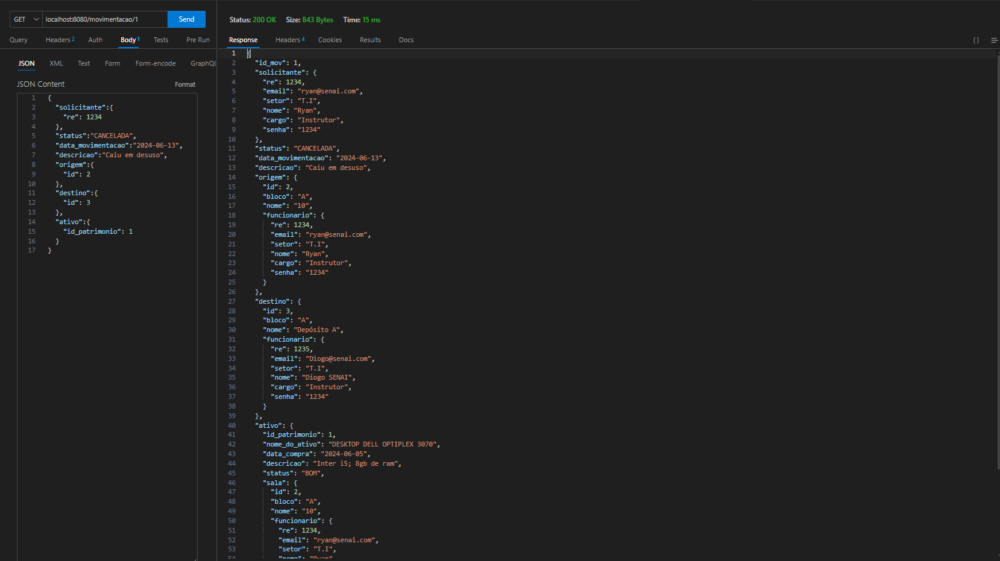
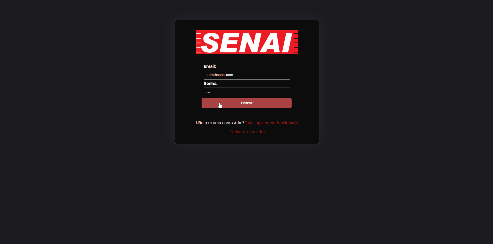

# Documentação do Sistema de Gerenciamento de Estoque e Ativos Patrimoniais

## Visão Geral
Este documento descreve o Sistema de Gerenciamento de Estoque e Ativos Patrimoniais desenvolvido para uma unidade escolar do SENAI-SP. O sistema tem como objetivo principal controlar o estoque de materiais e equipamentos utilizados na unidade, bem como gerenciar os ativos patrimoniais pertencentes à instituição.

## Levantamento de requisitos:

Em um primeiro momento foi notado, algumas complicações na hora de se fazer uma verificação de patrimônios presentes na escola, por exemplo, verificar patrimonios cadastrados em um ambiente, buscar um patrimonio, atualizar o status e descrição de um patrimônio. Também, foi solicita uma melhora no sistema de gestão de estoque de itens de consumo, categorizando-os e separando-os de acordo com seu departamento, por exemplo: Informática, elétrica, mecânica, etc..
Também levamos em conta a possibilidade de movimentações, e registrar essas movimentações para que o sistema sempre se mantenha atualizado.

## Arquitetura do Sistema
O Sistema de Gerenciamento de Estoque e Ativos Patrimoniais foi desenvolvido utilizando a seguinte arquitetura:
- Linguagem de programação: Java
- Framework backend: Java SpringBoot
- Banco de dados: PostgreSQL
- Interface de usuário: HTML/CSS

## Desenvolvimento:

### Estrutura de dados:
    Em um primeiro momento, o grupo decidiu estrutar a base de dados para compreendermos a maneira que as classes se comunicariam, assim fizemos o nosso primeiro diagrama, que até o final do desenvolvimento passou por algumas alterações, como a criação da tabela Administrador:

<h1>

 
</h1>

### API REST:
    Após termos uma base da estrutura de dados definida, começamos a produzir de fato iniciando pela API REST. Pensamos em funções tipo CRUD (Create, Read, Update, Delete) para as principais classes SALAS, PATRIMONIOS, FUNCIONARIOS, MOVIMENTACAO, CONSUMO e ADM.
### - FUNCIONARIOS:
#### -- Listar todos os funcionarios:
<h1>

 
</h1>

#### -- Cadastrar um funcionario:
<h1>

 
</h1>

#### -- Selecionar um funcionario:
<h1>

 
</h1>

#### -- Editar um funcionario:
<h1>

 
</h1>

### - SALAS:

#### -- Listar todas as salas:
<h1>

 
</h1>

#### -- Cadastrar uma nova sala:
<h1>

 
</h1>

#### -- Editar uma sala:
<h1>

 
</h1>

### - Patrimonios:

#### -- Cadastrar um novo patrimonio:
<h1>

 
</h1>

#### -- Listar todos os patrimonios:
<h1>

 
</h1>

#### -- Editar um patrimonio:
<h1>

 
</h1>

#### -- Selecionar um patrimonio:
<h1>

 
</h1>

### - MOVIMENTAÇÃO:

#### -- Cadastrar uma nova movimentacao:
<h1>

 
</h1>

#### -- Listar todos as movimentacoes:
<h1>

 
</h1>

#### -- Editar uma movimentacao:
<h1>

 
</h1>

#### -- Selecionar uma movimentacao:
<h1>

 
</h1>

### - CONSUMO:

#### -- Cadastrar um novo produto de consumo:
<h1>

 
</h1>

#### -- Listar todos os produtos de consumo:
<h1>

 
</h1>

#### -- Editar um produto de consumo:
<h1>

 
</h1>

#### -- Excluir um produto de consumo:
<h1>

 
</h1>

## Funcionalidades

### Usuários
- Usuário comum feito para o funcionario, permite cadastrar patrimonios, ver patrimonios em um ambiente, registrar saida e entradas de produtos em estoque e solicitar movimentacoes de patrimonios
- Usuário Administrador feito para os gestores, permite o acesso completo a aplicação além de aprovar ou reprovar movimentações e marca-las como concluída ou cancelada.

### Controle de Estoque
- Registrar de entrada de materiais no estoque.
- Registrar de saída de materiais do estoque.
- Consulta de saldo de materiais em estoque.

### Gerenciamento de Ativos Patrimoniais
- Cadastro de novos ativos patrimoniais.
- Consulta de informações de ativos patrimoniais.
- Atualização e exclusão de ativos patrimoniais.
- Verificação de patrimônios em uma sala específica.

### Controle de Funcionários Sobre a Plataforma
- Consulta de funcionários cadastrados na plataforma.
- Verificação de cadastro de usuário

### Controle de Movimentações dos patrimônios:
- Solicitar uma movimentação
- Aprovar/ Reprovar movimentação
- Concluir/ Cancelar movimentação
- Registrar todas as movimentações

### Relatórios
- Relatório de estoque atualizado.
- Relatório de ativos patrimoniais.
- Relatório de funcionários cadastrados.
- Relatório de controle de estoque por ambiente.

## Resultado Final:

### Acesso ao usuário administrador:
<h1>

 
</h1>

## Instalação e Configuração
[Descreva aqui as instruções necessárias para instalação e configuração do sistema, incluindo pré-requisitos de software e passos para configuração do banco de dados, se aplicável.]

## Guia do Usuário
[Forneça um guia simples para os usuários finais sobre como utilizar o sistema, incluindo instruções para login, navegação nas funcionalidades e geração de relatórios.]

## Créditos
[Se aplicável, forneça informações sobre como outros desenvolvedores podem contribuir para o projeto, incluindo orientações sobre como enviar pull requests ou relatar problemas.]

## Colaboradores da Criação do Sistema
[Forneça informações de contato para suporte ou dúvidas relacionadas ao sistema.]

